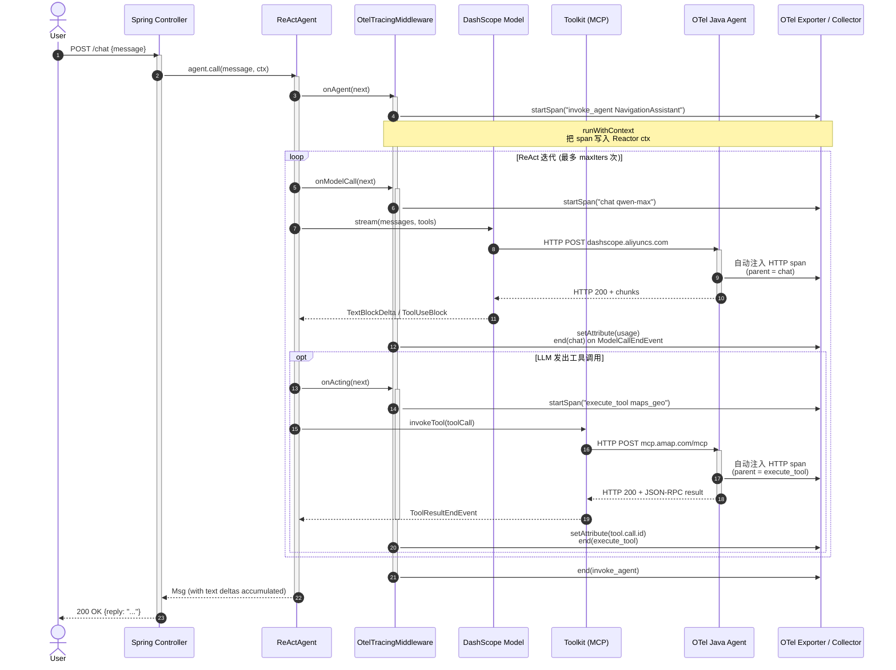

# OtelTracingMiddleware 实现原理分析

## 一、整体定位

`OtelTracingMiddleware` 是 AgentScope **业务层**的 OTel 集成点，对应 `MiddlewareBase` 接口的三个 hook：

| Hook | 触发时机 | 产生的 span |
|---|---|---|
| `onAgent` | 整个 `agent.call()` / `streamEvents()` 调用 | `invoke_agent <name>` |
| `onModelCall` | 每次 LLM API 调用 | `chat <modelName>` |
| `onActing` | 每次工具调用 | `execute_tool <name>` |

注意：`onReasoning` 和 `onSystemPrompt` 它**没实现**——前者产生的事件流是 `onAgent` 的子集，后者是字符串处理不需要 span。

底层 OTel 数据（HTTP client 调 DashScope、HTTP client 调 AMap MCP）由**官方 OTel Java Agent** 自动注入，不在这层。这就是 BasicChatExample 启动时挂 `-javaagent:opentelemetry-javaagent.jar` 的原因——它和 `OtelTracingMiddleware` **各管一段**，靠 `GlobalOpenTelemetry` 共用同一个 trace。

## 二、三层 span 的拓扑

```
invoke_agent NavigationAssistant               ← onAgent
  ├─ chat qwen-max (driving reasoning)         ← onModelCall #1
  │   └─ HTTP POST dashscope.aliyuncs.com      ← Java Agent (HTTP client instrumentation)
  ├─ execute_tool maps_geo                     ← onActing #1
  │   └─ HTTP POST mcp.amap.com/mcp            ← Java Agent
  ├─ chat qwen-max (post-tool reasoning)       ← onModelCall #2
  │   └─ HTTP POST dashscope.aliyuncs.com
  └─ execute_tool maps_direction_driving       ← onActing #2
      └─ HTTP POST mcp.amap.com/mcp
```

两个关键事实：

1. **业务 span 是 HTTP span 的祖先**——`setParent(parentContext)` 把业务 span 的 ctx 作为 Java Agent 注入的 HTTP span 的 parent（因为 `ContextPropagationOperator.runWithContext` 把 OTel ctx 写入 Reactor ctx，Reactor 的线程切换会带着 ctx 走，下游 HTTP client 通过 ThreadLocal 自动接入）。

2. **一个 `invoke_agent` 包含多次 `chat`**——ReAct loop 里 LLM 调多次（reasoning → tool call → reasoning → tool call → ...），所以 agent span 是多次 model span 的祖先。

## 三、关键实现技巧

### 1. Reactor 异步链 + 线程切换的 ctx 传播

最核心的难点：Reactor 的 `subscribeOn`/`publishOn` 会切换线程，OTel 默认 ThreadLocal-based ctx 会丢失。

解决：**双重 ctx 解析**

```java
private Context resolveOtelContext(ContextView ctxView) {
    return ContextPropagationOperator.getOpenTelemetryContextFromContextView(
            ctxView, Context.current());   // ThreadLocal 兜底
}
```

先从 Reactor 的 `ContextView` 里找（`ContextPropagationOperator` 在类加载时通过 `registerOnEachOperator()` 全局注入 Reactor 算子，每次 `onNext` 会把 OTel ctx 镜像到 Reactor ctx），找不到再回退到 `Context.current()`（ThreadLocal）。

### 2. Reactor context ↔ OTel context 的双向桥接

```java
Context otelCtx = span.storeInContext(parentContext);
return ContextPropagationOperator.runWithContext(
        next.apply(input)
            .doOnNext(...)
            .doOnComplete(...)
            .doOnError(...),
        otelCtx);
```

`storeInContext` 把当前 span 打包成 OTel ctx，`runWithContext` 让下游整个 reactive pipeline **在这个 ctx 里运行**——下游任何 OTel API 调用（无论在哪个线程）都会拿到这个 span 作为 parent。

### 3. 单次注册的 global Reactor hook

```java
private static volatile boolean hookRegistered = false;

public OtelTracingMiddleware() {
    if (!hookRegistered) {
        synchronized (OtelTracingMiddleware.class) {
            if (!hookRegistered) {                              // ← double-checked
                ContextPropagationOperator.builder().build().registerOnEachOperator();
                hookRegistered = true;
            }
        }
    }
}
```

经典 **DCL（double-checked locking）** + `volatile`——保证多线程下 `registerOnEachOperator()` 只调一次，但每次构造 `OtelTracingMiddleware` 的开销几乎为零（无锁快路径）。`BasicChatExample` 每请求都 `new OtelTracingMiddleware()`，所以这个保护很重要。

### 4. Span 终结的幂等性

```java
AtomicReference<Boolean> ended = new AtomicReference<>(false);

.doOnComplete(() -> {
    if (ended.compareAndSet(false, true)) {    // ← 唯一调用点
        span.setStatus(StatusCode.OK);
        span.end();
    }
})
.doOnError(e -> { ... 同样的 CAS ... })
.doOnCancel(() -> { ... 同样的 CAS ... })
```

三个终止路径（正常完成 / 出错 / 取消）共用一个 CAS 标志，确保 `span.end()` **只被调一次**——重复调用会导致 `IllegalStateException`。

### 5. Tool span 名去重（防 cardinality 爆炸）

```java
private static String buildToolSpanName(ActingInput input) {
    if (input.toolCalls() == null || input.toolCalls().isEmpty()) return "unknown";
    String first = input.toolCalls().get(0).getName();
    int rest = input.toolCalls().size() - 1;
    return rest > 0 ? first + " (+" + rest + " more)" : first;
}
```

如果一个 `Acting` 阶段并发调 5 个工具，span 名是 `execute_tool maps_geo (+4 more)` 而不是把 5 个名字拼起来。这样后端 metric 标签基数可控，但**完整列表仍可在 `gen_ai.tool.name` 属性里查到**（逗号分隔）。

### 6. 通用属性（每个 span 都有）

```java
private static void setCommonAttributes(Span span) {
    span.setAttribute("agentscope.runtime.java", System.getProperty("java.version", "unknown"));
    span.setAttribute("gen_ai.resource.id", firstNonBlank(System.getenv("AGENTSCOPE_RESOURCE_ID"), "57e005b686cb405ea0c995d1b5961dac"));
    span.setAttribute("gen_ai.resource.type", "agent");
}
```

- `agentscope.runtime.java`：让后端按 JVM 版本切片
- `gen_ai.resource.id`：租户/项目 ID（`AGENTSCOPE_RESOURCE_ID` env var，覆盖默认华为云 APM）
- `gen_ai.resource.type`：固定 `"agent"`，区分 agent / model / tool

## 四、GenAI 语义约定

span 属性命名遵守 [OpenTelemetry GenAI semantic conventions](https://opentelemetry.io/docs/specs/semconv/gen-ai/)，所以数据可以接入任何支持 GenAI 的后端（DashScope、Datadog、Honeycomb 等）：

| 属性 | 出现位置 | 含义 |
|---|---|---|
| `gen_ai.operation.name` | 所有 span | `invoke_agent` / `chat` / `execute_tool` |
| `gen_ai.agent.name` / `agent.id` | agent span | agent 标识 |
| `gen_ai.request.model` | chat span | 模型名 |
| `gen_ai.request.messages.count` / `tools.count` | chat span | 请求规模 |
| `gen_ai.usage.input_tokens` / `output_tokens` | chat span（`ModelCallEndEvent` 时回填） | 计费/性能 |
| `gen_ai.tool.name` / `tool.call.count` / `tool.call.id` | execute_tool span | 工具信息 |

`setModelResponseAttributes` 是**事后回填**——start span 时还不知道 token 数，等到 `ModelCallEndEvent` 流过来时再补。

## 五、性能特征

### 零开销降级路径

当 OTel SDK 没配（只有默认的 no-op `GlobalOpenTelemetry`）：

- `getTracer()` 拿到的 `Tracer` 是 `NoOpTracer`
- `spanBuilder().startSpan()` 返回 `NonRecordingSpan`（无 IO）
- `setAttribute()` 立即丢弃
- `end()` 立即返回

整条链路开销是几个虚函数调用 + 几次 null check。

### 与 Java Agent 的分工

| 维度 | `OtelTracingMiddleware` | OTel Java Agent |
|---|---|---|
| span 类别 | 业务层（agent/chat/execute_tool） | 基础设施层（HTTP / DB / JVM） |
| 注入方式 | 显式 `.middleware(new OtelTracingMiddleware())` | `-javaagent:...jar` 启动参数 |
| 上下文 | 通过 `ContextPropagationOperator` 接入 Reactor | 通过 bytecode 注入接入 HTTP client |
| 配置 | 代码里写死属性 | `otel.*` 系统属性/环境变量 |

两者**通过 `GlobalOpenTelemetry` 共享一个 TracerProvider**，因此所有 span 自然串到同一个 trace——业务 span 是 HTTP span 的祖先。

## 六、典型数据流（一次 MCP 工具调用）

```
T1: ReActAgent 决定调 maps_direction_driving
    → MiddlewareChain.build().apply(onActing)
    → OtelTracingMiddleware.onActing:
       - parentContext = 上层 chat span 的 ctx
       - 创建 "execute_tool maps_direction_driving" span
       - runWithContext → 把它写进 Reactor ctx

T2: 工具实际执行（同步阻塞，订阅在 boundedElastic 线程）
    → Java Agent 注入的 HttpClient instrumentation 创建子 span "POST mcp.amap.com/mcp"
       - 它的 parent 是 T1 的 span（通过 ThreadLocal 自动捕获）

T3: 工具返回 ToolResultEndEvent
    → setToolCallIds(span, {tool-call-id})
    → runWithContext 的下游 .doOnComplete 触发
    → setStatus(OK), span.end()
```

T1 创建的 span 跨越 T2 的线程切换而保持父子关系，这就是 `ContextPropagationOperator` 的价值。

## 六点五、时序图

下面这张图把一次完整的"用户提问 → 模型推理 → MCP 工具调用 → 返回结果"的 span 采集过程按时间顺序铺开，覆盖前面所有技巧：



### 读图要点

1. **MW 的三个 hook 都遵循同一模式**：`runWithContext(next.apply(...))` 把刚创建的 span 注入 Reactor ctx，下游所有 OTel API 自动看到它是当前 active span。
2. **JA 的 HTTP span 是"自动的"**——它通过 ThreadLocal 在 HTTP client 发起请求时自动捕获当前 OTel ctx，所以**不需要** OTel 中间件显式调用什么。代价是这一切依赖于 Java Agent 启动时挂在 `-javaagent:...jar` 上。
3. **`autonumber` 自动编号**对应到第二节拓扑图里的 span 嵌套顺序：1 启动 agent span → 2 启动 chat span → 3 JA 注入 HTTP span → 4 结束 chat → 5 启动 execute_tool → 6 JA 注入 MCP HTTP span → 7 结束 execute_tool → 8 结束 agent。
4. **`opt` 块**表示循环体内的分支：只有当 LLM 决定调工具时才进 `onActing`，纯文本回复不会触发。
5. **每次循环结束后回到 `onModelCall`**——这是 ReAct 的核心：reasoning → acting → reasoning，直到 LLM 输出纯文本为止（`isFinished(msg)` 返回 true）。

## 七、改进点（如果让我重写，会考虑）

1. **`onReasoning` 没覆盖**：如果想看"思考过程"的 span，要补上；现在 reasoning 事件是 `onAgent` span 的一部分，没法独立计时
2. **没有 sampling 控制**：每个请求都产生完整 trace，高 QPS 下成本高。生产环境应该读 `OTEL_TRACES_SAMPLER`
3. **OTLP exporter 未内置**：依赖 Java Agent 或用户自己接 SDK。当前示例用 Java Agent 没问题，但 standalone 部署（不要 javaagent）就裸奔了
4. **`invoke_agent` span 缺结束属性**：没有 `gen_ai.usage.*` 聚合，可以在 `AgentResultEvent` 时把多个 chat span 的 token 数加起来